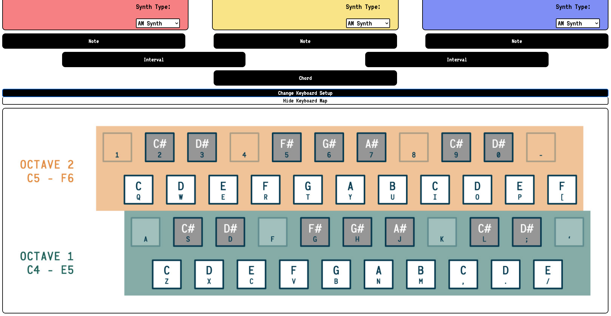
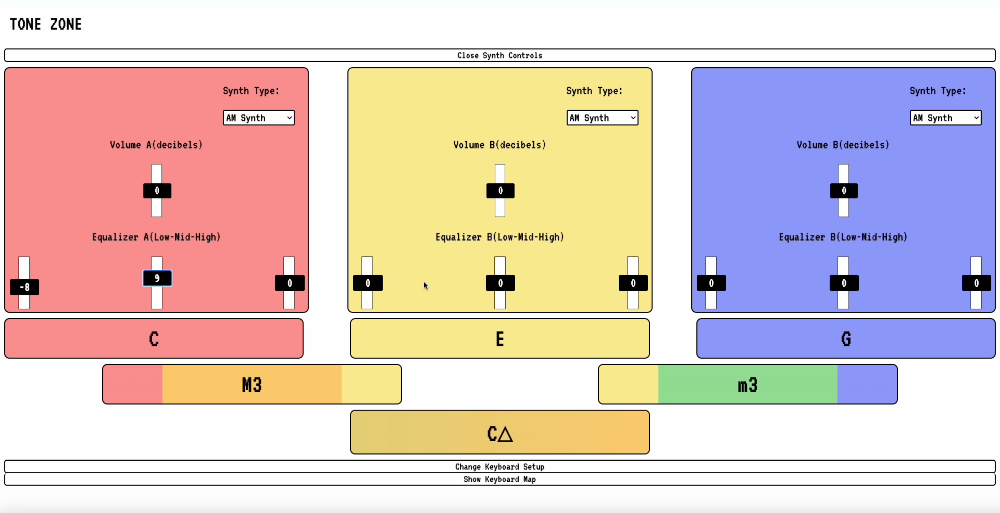

# TONE ZONE: A web-based application for the exploration of the fundamentals of music

## 

## Description

This simple JavaScript-based web application leverages web browsers’ in-built synthesizer capabilities. It allows the user to select from multiple synthesizer-types and modify their tonal quality. The page displays an analysis of harmonies onto simple and elegant UI.

The key feature of this application is its capacity to identify/display notes and analyze/display their harmonic relationships. Similar live chord-analysis tools exist in the context of digital audio workstation (DAW) softwares such as GarageBand or Logic, but without the additional interval analysis of this application. As such, with this app, I wish to create a context of musical exploration and learning. I wish to help users increase their understanding and command over the harmonic aspect of music.

### Technologies

- JavaScript, HTML, CSS
- [Handlebars.js](https://handlebarsjs.com/) -- templating engine for dynamic rendering of pages
- [Tone.js](https://tonejs.github.io/)
  -- From site: "Tone.js is a Web Audio framework for creating interactive music in the browser. The architecture of Tone.js aims to be familiar to both musicians and audio programmers creating web-based audio applications. On the high-level, Tone offers common DAW (digital audio workstation) features like a global transport for synchronizing and scheduling events as well as prebuilt synths and effects. Additionally, Tone provides high-performance building blocks to create your own synthesizers, effects, and complex control signals."
- [AudioKeys.js](https://github.com/kylestetz/AudioKeys)-- for mapping notes to QWERTY keyboard
- Heroku for site deployment
- GitHub for project management

### Skills/Concepts

- MVC (Model-View-Controller) architectural design
- Modularization/ componentization of JavaScript--- DOM elements in one file; helper functions as well as the static data they draw upon in one file; and the main script that interacts and gives functionality to the UI in another file.
- Use of browsers' in-built synthesizer engine, or "Web Audio Context"
- Use of Heroku to deploy web application

## Table of Contents

- [Installation](#installation)
- [Usage](#usage)
- [Contributions](#contributions)
- [License](#license)

## Installation

Visit the GitHub repo here: [REPO](https://github.com/danrcross/tone-zone)

Visit the deployed site here: [SITE](https://tone-zone-1314e3af579c.herokuapp.com/)

## Usage

The various notes of the traditional 12-tone scale can be played using a standard QWERTY keyboard. The page includes an image that shows how the notes are mapped onto the keys of the keyboard. Additionally, the user may toggle the mapping between two options: a 2-octave setup, and a one-octave setup with the ability to toggle up and down between octaves.

The app allows the simultaneous play of 3 separate software synthesizers. In practical terms, the user can play up to 3 notes simultaneously. Each synthesizer, operating seperately but in tandem, produces its own distinct tonal quality, which can be selected from a dropdown-menu appended to each synthesizer.

When a single note is pressed, the first synthesizer (A) will play the pitch; when a second is pressed, the second synth (B); and when a third is pressed, the third synth will play that pitch (C).

Below the synthesizers, the note(s) name(s) will be displayed in the order of their pitch hierarchy: lowest note on the left, highest on the right. Additionally, each note will be background-color-coded corresponding to the color of the synth that played that note (A: Red, B: Yellow, C: Blue).

If two notes are held simultaneously, the first interval display (on the next row) will be activated. It will display the name of the harmonic interval created between these two notes, in standard interval notation (i.e. "m3" for a minor 3rd interval).

If three notes are held simultaneously, the second interval display as well as the chord display will be activated. In this case, the first interval display would name the interval between the lowest and middle notes, and the second interval display would name the interval between the middle and highest notes. Lastly, the chord display would show the name of the chord created by the 3 notes (if such a name exists in common practice).

ADDITIONAL FEATURES:
A secondary feature of this application can be found by pressing the "Open Synth Controls" button near the top of the page. This button opens up a control panel on each synthesizer that allows the user to adjust the volume of the tone produced that synth, as well as the "EQ" balance between the different frequency ranges (low, middle, high) of the tone produced by that synth.

## License

This application is covered under the [MIT](https://opensource.org/licenses/MIT) license.

## Contributions

- [Tone.js Web Audio framework](https://tonejs.github.io/)
- YouTube channel [The Code Creative](https://www.youtube.com/@TheCodeCreative), for Tone.js tutorials
- [AudioKeys.js](https://github.com/kylestetz/AudioKeys), npm package and QWERTY map images
- ChatGPT AI was used for the generation of repetitive arrays of data (such as the list of the 88 notes of the piano and its related data), but not for the building of any other code!

## Tests

No tests used for the development of this app!

## Questions

Any Questions? Click a link below to visit my GitHub and/or email me!

For emails, please use this format in the subject line: 'GitHub: {NAME_OF_REPOSITORY}'

[GitHub](https://github.com/danrcross)

[Email](mailto:danrcross@gmail.com)
